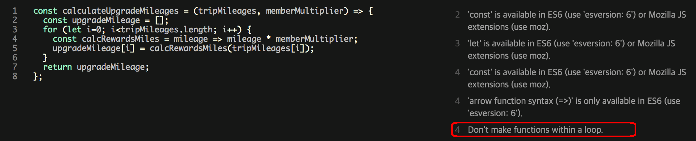

# CH 2. 도구 다루기

## TDD와 BDD
* TDD(Test Driven Development)  
  * 애플리케이션 코드를 짜기 **전**에 테스트 코드를 **먼저** 작성하는 방법.  
    * 자신이 생각하지 못한 케이스도 테스트 코드가 잡아주기도 함.  
    * 일종의 안전장치이기 때문에 리팩토링이 수월해짐.  
* BDD(Behavior Driven Development)  
  * "어떤 행위를 해야 한다(should do something)"라는
    형태의 문장으로 작성하여 어떻게(How)보다는 무엇(What)을 하는지에 대한 테스트에 집중하게 하는 접근법.
  * 테스트는 작아야하고, 한 가지를 테스트해야한다.  
    어플리케이션 전체가 아닌 작지만 많은 수의 테스트를 작성한다.
    
## Spy
### 테스트 더블
어떤 함수/객체의 **본래 구현부**를 테스트 도중 **다른(보통 더 간단한) 코드**로 대체한 것.  
외부 자원과의 의존 관계(웹 서비스 등등)를 없애고 단위 테스트의 복잡도를 낮출 목적으로 사용.

### spyOn(obj, method)
특정 객체의 메소드를 목(mock: 모조품, 테스트를 위한 객체나 데이터)으로 만들 수 있음.  
해당 메소드를 완전히 덮어버려서 원본을 호출하지 않음.

## DI(Dependency Injection)
Attendee 객체 안에 HTTP 통신을 하는 ConferenceWebSvc 객체,  
메시지마다 OK 버튼이 있는 Messenger 객체.
```javascript
class Attendee {
  constructor(attendeeId) {
    this.attendeeId = attendeeId;
    this.service = new ConferenceWebSvc();
    this.messenger = new Messenger();
  }
  reserve(sessionId) {
    if(this.service.reserve(this.attendeeId, sessionId)) {
      this.messenger.success("좌석 예약이 완료되었습니다! 고객님은 " +
                             `${this.service.getRemainingReservations()} 좌석을 추가 예약하실 수 있습니다.`);
    } else {
      this.messenger.failure("죄송합니다 해닥 좌석은 예약하실 수 없습니다.");
    }
  }
}

const instance = new Attendee(34);
```
의존성 ConferenceWebSvc 객체와 Messenger 객체를 주입받은 Attendee 객체
```javascript
class Attendee {
  constructor(service, messenger, attendeeId) {
    this.attendeeId = attendeeId;
    this.service = service;
    this.messenger = messenger;
  }
  reserve(sessionId) {
    if(this.service.reserve(this.attendeeId, sessionId)) {
      this.messenger.success("좌석 예약이 완료되었습니다! 고객님은 " +
                             `${this.service.getRemainingReservations()} 좌석을 추가 예약하실 수 있습니다.`);
    } else {
      this.messenger.failure("죄송합니다 해닥 좌석은 예약하실 수 없습니다.");
    }
  }
}

// 실제 운영 환경
const instance = new Attendee(new ConferenceWebSvc(), new Messenger(), 34);
// 개발(테스트) 환경
// fake는 스파이 같은 대체제를 주입하면 된다.
// fake는 메소드는 같지만 처리 로직은 가짜인 객체이다.
const instance2 = new Attendee(fakeService, fakeMessenger, id);
```

우리가 만든 의존성 주입 프레임워크를 써서 기존의 코드를 개선시키기
```javascript
const attendeeId = 123,
      sessionId  = 1,
      MyApp      = {};
MyApp.diContainer = new DiContainer6();
MyApp.diContainer.register(
  "Service",            // 웹 서비스를 가리키는 DI 태그
  [],                   // 의존성 없음
  () => new ConferenceWebSvc() // 인스턴스를 반환하는 함수
);
MyApp.diContainer.register("Messenger", [], () => new Messenger());
MyApp.diContainer.register(
  "AttendeeFactory",
  ["Service", "Messenger"], // Attendee는 service 및 messenger에 의존한다.
  (service, messenger) => (
    attendeeId => new Attendee(service, messenger, attendeeId)
  )
);
const attendee = MyApp.diContainer.get("AttendeeFactory")(attendeeId);
attendee.reserve(sessionId);
```

## AOP(Aspect Oriented Programming)
캐싱 없는 함수 구현부.
```javascript
// 컨퍼런스에 해당하는 파라미터를 제공하여 여행사의 원래 웹 서비스를 래핑한다.
const TravelService = (rawWebservice => {
  const conferenceAriport = "BOS",
        maxArrival        = new Date(/* 날짜 */),
        minDeparture      = new Date(/* 날짜 */);
  
  return {
    getSuggestedTicket(homeAirport) {
      // 고객이 전체 컨퍼런스에 참가한 수 있게
      // 해당 지역의 공항에서 가장 저렴한 항공권을 조회한다.
      return rawWebservice.getCheapestRoundTrip(
        homeAirport, conferenceAriport, maxArrival, minDeparture
      );
    }
  };
})();

// 광고 정보를 가져온다.
TravelService.getSuggestedTicket(attendee.homeAirport);
```

AOP 없는 캐싱 함수 구현부.
```javascript
// 컨퍼런스에 해당하는 파라미터를 제공하여 여행사의 원래 웹 서비스를 래핑한다.
const TravelService = (rawWebservice => {
  const conferenceAriport = "BOS",
        maxArrival        = new Date(/* 날짜 */),
        minDeparture      = new Date(/* 날짜 */);
  let   cache             = []; // 간단한 캐싱, 인덱스는 공항이고 객체는 티켓.

  return {
    getSuggestedTicket(homeAirport) {
      let ticket;
      if(cache[homeAirport]) return cache[homeAirport];

      ticket = rawWebservice.getCheapestRoundTrip(
        homeAirport, conferenceAriport, maxArrival, minDeparture
      );
      cache[homeAirport] = ticket;
      return ticket;
    }
  };
})();
```

[Aop.js 프레임워크](http://fredrik.appelberg.me/2010/05/07/aop-js.html)
```javascript
const Aop = {
  // 주어진 네임 스페이스에 매칭되는 모든 함수 주변(around)에 어드바이스를 적용한다.
  around(pointcut, advice, namespaces) {
    // 네임 스페이스가 없으면 전역 네임 스페이스를 찾아내는 꼼수를 쓴다.
    if(namespaces === undefined || namespaces.length === 0) {
      namespaces = [(function() {return this;}).call()];
    }
    // 네임 스페이스를 전부 순회한다.
    for(const i in namespaces) {
      const ns = namespaces[i];
      for(const member in ns) {
        if(typeof ns[member] === "function" && member.match(pointcut)) {
          ((fn, fnName, ns) => {
            // member fn 슬롯을 'advice' 함수를 호출하는 래퍼로 교체한다.
            ns[fnName] = function() {
              return advice.call(this, {fn, fnName, arguments});
            }
          })(ns[member], member, ns);
        }
      }
    }
  },
  next(f) {
    return f.fn.apply(this, f.arguments);
  },
  before(pointcut, advice, namespaces) {
    Aop.around(pointcut, function(f) {
      advice.apply(this, f.arguments);
      return Aop.next.call(this, f)
    }, namespaces);
  },
  after(pointcut, advice, namespaces) {
    Aop.around(pointcut, function(f) {
      const ret = Aop.next.call(this, f);
      advice.apply(this, f.arguments);
      return ret;
    }, namespaces);
  }
};
```

최종 예제는 아래 링크에서 확인 가능.  
[AOP 예제 꾸러미](https://github.com/gilbutITbook/006844/tree/master/2%EC%9E%A5/AOP)

## 코드 검사 도구
[A Comparison of JavaScript Linting Tools](https://www.sitepoint.com/comparison-javascript-linting-tools/)
### JSLint
* 장점  
  * 환경설정을 할 필요 없이 그냥 쓰기만 하면 된다.(당신이 환경설정을 강제로 따르기만 한다면)  
  * Comes configured and ready to go (if you agree with the rules it enforces)  
* 단점  
  * 환경설정이 너무 빡빡하다.  
  * 설정을 바꿀 수 없다.  
  * 즉 사용자 설정을 추가할 수 없다.  
  * 공식문서가 허접하다.
  
### JSHint
* 장점  
  * 환경설정을 바꿀 수 있다.  
  * 다른 라이브러리들과도 쿵짝이 잘 맞는다.  
  * 반복문 내의 함수 선언 및 할당의 로직 상의 오류도 잡아냄.  
      
* 단점  
  * 사용자가 설정을 추가할 수 없다.  
  * 어느 설정이 에러를 유발하는지 알기 힘들다.  
  * 반복문 내의 함수 선언 및 할당이라면 무조건 오류로 잡아냄.  
    
    
### JSCS
* 장점  
  * 기본 설정들이 있어서 코딩 컨벤션을 세우기가 쉽다.  
* 단점  
  * 코딩 컨벤션 이외의 내용은 체크하지 않는다.
  
### ESLint
* 장점  
  * 환경설정이 매우 유연하고, 플러그인도 다양하다.  
  * JSX 문법도 지원한다.  
* 단점  
   * 몇몇 설정은 필수적으로 들어가야한다.  
   * 반복문 내의 함수 선언 및 할당의 로직 상의 오류를 잡아내지 못함.
   
#### 설치 및 설정
```bash
npm i -g eslint
npm i -D eslint-plugin-jasmine eslint-html-reporter
eslint --init
```

기본 설정을 마친 후 .eslintrc.js에 다음과 같은 설정을 추가해줘야 함.
```json
module.exports = {
  "env": {
    "jasmine": true
  },
  "extends": ["plugin:jasmine/recommended"],
  "plugins": ["jasmine"]
}
```

이제 커맨드 라인에 다음과 같이 쳐주면 html 파일로 lint 결과가 나옴.
```bash
eslint 02-도구_다루기/04-코드_검사_도구/*.js -f node_modules/eslint-html-reporter/reporter.js -o eslint.html
```

매번 일일이 치기 귀찮으므로 packge.json의 npm sciprt를 이용.
```bash
{
  "scripts": {
    "lint": "eslint 02-도구_다루기/04-코드_검사_도구/*.js -f node_modules/eslint-html-reporter/reporter.js -o eslint.html; open eslint.html"
  }
}
```
## 참조 링크
[BDD에 대해 참조한 링크](http://m.blog.naver.com/genycho/220706542138)  
[Jasmine의 문법들을 설명한 링크](http://kbs0327.github.io/blog/technology/jasmine/)  
[Mock 객체](http://kws8008.tistory.com/entry/Mock-%EA%B0%9D%EC%B2%B4)  
[Jasmine Spy 사용하기](http://ohgyun.com/438)  
[A Comparison of JavaScript Linting Tools](https://www.sitepoint.com/comparison-javascript-linting-tools/)